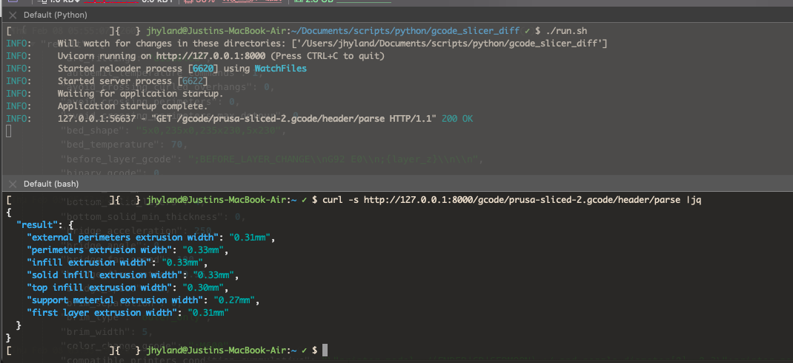
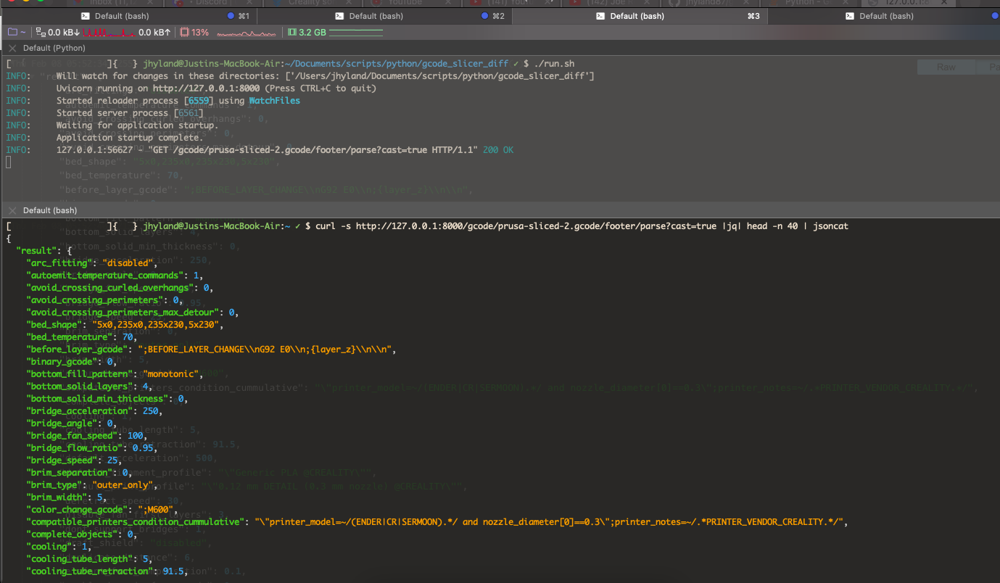
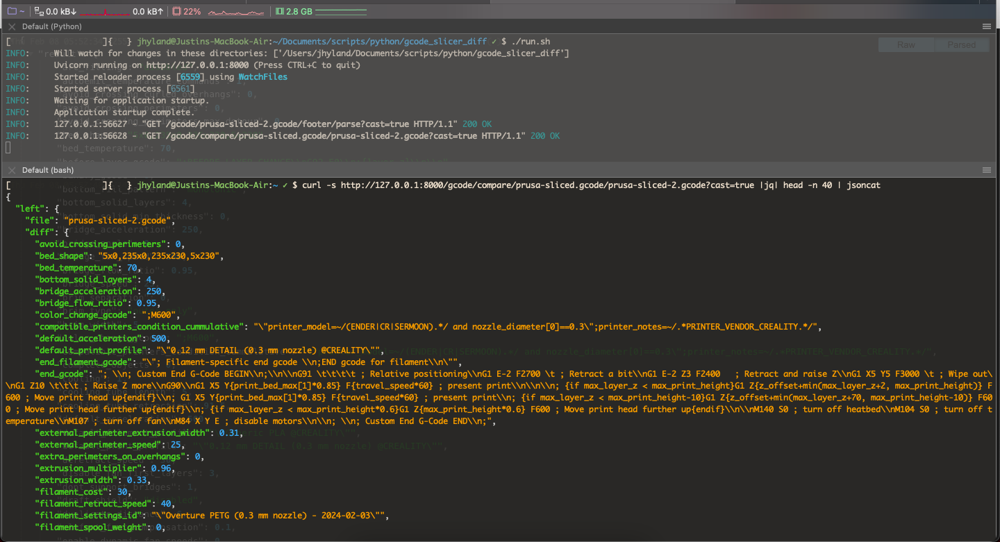

# Gcode Slicer Config Parser
Just a simple Python API server for parsing Gcode files to retrieve the metadata and slicer config settings from the Gcode source. 
Can be used to just retrieve the meta data, or compared with other gcode files to assess any slicer changes made between prints. 

This is intended to be installed on a RaspberryPi with Klipper. It currently only looks at local files, but the logic is implemented in such a way that gcode files retrieved via HTTP can easily be parsed as well (it's just not necessary right now).

## Slicers
Right now it only parses out Prusa sliced Gcode files, though I am working on setting up a slicer base class to be used as an interface for slicer-specific classes, which will make comparing gcode files generated from different slicers possible (similar to how the [metadata](https://github.com/Arksine/moonraker/blob/master/moonraker/components/file_manager/metadata.py#L109) is handled in MoonRaker)


# Run

``` bash
uvicorn server:app --reload
```

# Examples

Parse header via _http://127.0.0.1:8000/gcode/prusa-sliced-2.gcode/header/parse_


Parse footer via _http://127.0.0.1:8000/gcode/prusa-sliced-2.gcode/footer/parse?cast=true_


Compare two gcode configs via _http://127.0.0.1:8000/gcode/compare/prusa-sliced.gcode/prusa-sliced-2.gcode?cast=true_

