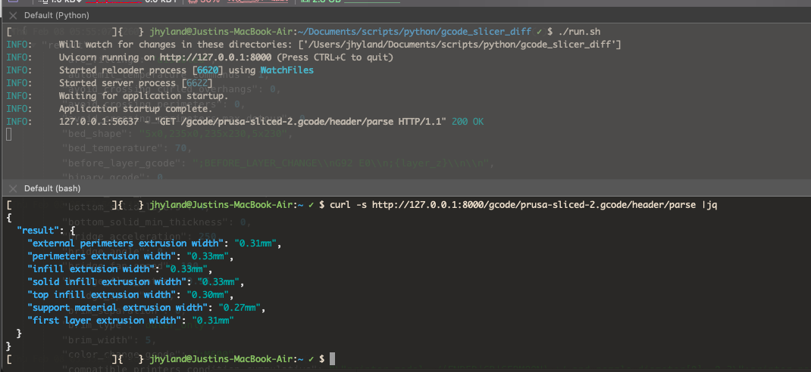
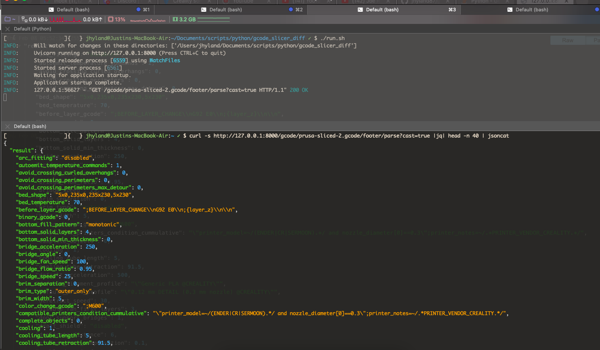
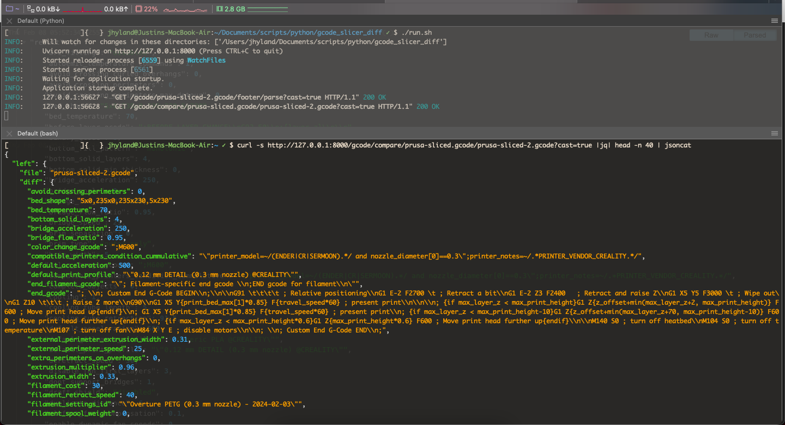
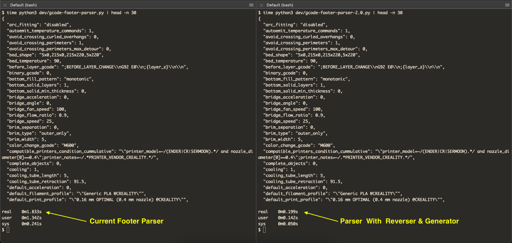

# Gcode Slicer Config Parser
Just a simple Python API server for parsing Gcode files to retrieve the metadata and slicer config settings from the Gcode source. 
Can be used to just retrieve the meta data, or compared with other gcode files to assess any slicer changes made between prints. 

This is intended to be installed on a RaspberryPi with Klipper. It currently only looks at local files, but the logic is implemented in such a way that gcode files retrieved via HTTP can easily be parsed as well (it's just not necessary right now).

## Slicers
Right now it only parses out Prusa sliced Gcode files, though I am working on setting up a slicer base class to be used as an interface for slicer-specific classes, which will make comparing gcode files generated from different slicers possible (similar to how the [metadata](https://github.com/Arksine/moonraker/blob/master/moonraker/components/file_manager/metadata.py#L109) is handled in MoonRaker)


# Run

``` bash
uvicorn server:app --reload
```

# Examples

Parse header via _http://127.0.0.1:8000/gcode/prusa-sliced-2.gcode/header/parse_
[_Full parsed header output here_](media/parse-header.json) 


Parse footer via _http://127.0.0.1:8000/gcode/prusa-sliced-2.gcode/footer/parse?cast=true_
[_Full parsed footer output here_](media/parse-footer.json)


Compare two gcode configs via _http://127.0.0.1:8000/gcode/compare/prusa-sliced.gcode/prusa-sliced-2.gcode?cast=true_
[_Full comparison output here_](media/compare-gcode-slicer-config.json)


# ToDo
1. Properly setup a base class parser that can be inherited and used when creating parsers for other slicers, similar to how Moonraker handles the slicer parser classes ([metadata.py](https://github.com/Arksine/moonraker/blob/master/moonraker/components/file_manager/metadata.py#L109))
2. Modify the routes to use search/query params for the filenames (or POST data) instead of `/gcode/compare/{left_filename}/{right_filename}`, so gcode files nested in other directories won't throw any errors.
3. Add a feature to allow diffing of more than 2 files.
4. The functions used to read and parse the gcode files ([gcode_utils.py](https://github.com/jhyland87/gcode_slicer_diff/blob/main/gcode_utils.py)) need to be updated to use generators. And for parsing the footer, it will see a great improvement if the file is just parsed in reverse order, instead of grabbing a specific amount of data from the end of the file to parse line by line.
    POC Of this improved method is [here](dev/gcode-footer-parser-2.0.py), with a screenshot of the comparison below (using a generator is more than 1.6 seconds faster with test files):
    
